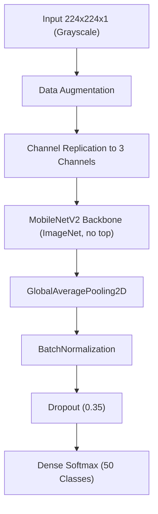
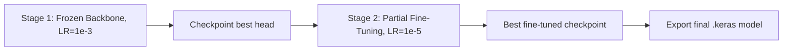

# MudraVision: Real-Time Bharatanatyam Mudra Recognition Using Transfer Learning With MobileNetV2 and Deployment-Oriented Computer Vision Integration

## Abstract
Hand mudra recognition is an important problem for culturally grounded human-computer interaction, assistive interfaces, and performance analytics in Indian classical dance. This paper presents an end-to-end mudra recognition system trained on the Bharatanatyam Mudra Dataset and deployed for real-time operation through OpenCV, MediaPipe, Flask, and a web frontend. The proposed learning pipeline uses grayscale input at 224 x 224 resolution, transfer learning with an ImageNet-pretrained MobileNetV2 backbone, two-stage training (frozen-head training followed by selective fine-tuning), and augmentation tailored for webcam variability. The notebook-derived dataset contains 28,431 images across 50 mudra classes, split with a stratified training/validation partition of 80/20. The final reported validation accuracy is 96.34%. A full-class evaluation pass reports 97.29% overall accuracy with macro-averaged F1-score of 0.9718 and weighted F1-score of 0.9728. Beyond model training, this work emphasizes deployment realism: live hand localization, optional HSV/YCrCb segmentation modes, smoothed prediction stabilization, and method-selectable runtime launching from a frontend. The paper documents architecture, experimental protocol, class-wise behavior, deployment engineering decisions, and practical limitations.

## Index Terms
Mudra recognition, Bharatanatyam, transfer learning, MobileNetV2, hand gesture recognition, real-time inference, MediaPipe, computer vision deployment.

## I. Introduction
Hand gestures are among the most information-rich nonverbal modalities in human communication. In Bharatanatyam and related Indian classical traditions, mudras encode symbolic, narrative, and expressive semantics. Automatic recognition of such gestures is relevant for dance pedagogy, archival indexing, performer feedback, culturally contextual HCI, and multimodal assistive systems.

Despite strong progress in generic hand gesture recognition, mudra recognition presents specific challenges: (i) fine-grained inter-class similarity, (ii) high intra-class variation across performers and viewpoints, (iii) illumination variability in webcam conditions, and (iv) deployment constraints for low-latency user-facing inference. To address these, we design and evaluate a transfer-learning system centered on MobileNetV2, using grayscale training and augmentation to improve robustness while preserving deployment efficiency.

This work contributes:
1. A reproducible training pipeline (from the notebook) for 50-class mudra recognition on 28,431 images.
2. A two-stage optimization strategy combining frozen-backbone learning and controlled fine-tuning.
3. A practical deployment stack that connects model inference with real-time camera handling, segmentation options, API serving, and frontend interaction.
4. Comprehensive class-wise metrics and deployment-focused analysis.

## II. Related Work
Vision-based hand gesture recognition has evolved from handcrafted descriptors to deep learning pipelines that combine detection, representation learning, and sequence modeling. Convolutional architectures remain strong baselines for static gesture classification [1], while lightweight mobile-friendly networks (e.g., MobileNet family) improve deployability [2], [3]. Transfer learning has repeatedly shown improved convergence and generalization for medium-sized gesture datasets [4], [5].

In pose and hand understanding, MediaPipe-based landmark localization offers robust real-time detection under commodity hardware constraints [6]. For segmentation-assisted hand modeling, HSV and YCrCb thresholding remain widely used classical techniques, particularly when computational cost and interpretability are critical [7], [8]. In addition, data augmentation strategies (rotation, translation, contrast jitter, zoom, mirror operations) are known to increase invariance under camera and user variability [9], [10].

In the domain of sign language and gesture systems, reported pipelines often combine region extraction, deep feature learning, and temporal smoothing at inference time [11]–[14]. Our system aligns with this deployment pattern but targets Bharatanatyam mudras and emphasizes practical integration from training notebook to end-user runtime interface.

## III. Dataset and Problem Formulation
### A. Dataset Source
The notebook clones the **Bharatanatyam-Mudra-Dataset** repository [15]. After cleaning hidden and non-class artifacts and normalizing folder names, the training code identifies:
- **Total classes:** 50
- **Total images:** 28,431

### B. Label Space
The 50 classes include `Alapadmam`, `Anjali`, `Aralam`, `Ardhachandran`, `Ardhapathaka`, `Berunda`, ..., `Varaha` (full class list preserved in the notebook-generated `class_names.json` and reproduced in runtime code).

### C. Data Split
The notebook uses:
- `validation_split = 0.2`
- seed = 123
- grayscale image loading with `image_dataset_from_directory`

Resulting partition:
- **Training:** 22,745 images
- **Validation:** 5,686 images

### D. Task Definition
Given an input hand image \(x\), classify it into one of \(K=50\) mudra classes. This is a multi-class single-label classification problem optimized with sparse categorical cross-entropy.

## IV. Methodology
### A. Preprocessing and Input Encoding
Training uses grayscale images resized to \(224 \times 224\). Since MobileNetV2 expects RGB-like 3-channel input, the grayscale tensor is channel-replicated before standard MobileNetV2 preprocessing:

\[
X_{3c} = \text{concat}(X_g, X_g, X_g)
\]

\[
\hat{X} = \text{preprocess\_input}(X_{3c})
\]

where \(X_g \in \mathbb{R}^{224 \times 224 \times 1}\).

### B. Data Augmentation
The notebook applies on-the-fly augmentation:
- random horizontal flip
- random rotation (0.08)
- random zoom (0.12)
- random translation (0.08, 0.08)
- random contrast (0.15)

These transforms are integrated as a Keras sequential preprocessing block inside the model graph.

### C. Network Architecture
The architecture is:
1. Input layer: \(224 \times 224 \times 1\)
2. Augmentation block
3. Channel triplication
4. MobileNetV2 backbone (ImageNet pretrained, `include_top=False`)
5. Global average pooling
6. Batch normalization
7. Dropout (0.35)
8. Dense softmax classifier (50 outputs)

Total parameters (notebook summary): **2,327,154**.

### D. Two-Stage Training Strategy
#### Stage 1: Frozen Backbone
- Backbone trainable = False
- Optimizer: Adam, learning rate \(1\times10^{-3}\)
- Epoch budget: 12
- Early stopping on validation accuracy (patience 5)
- ReduceLROnPlateau on validation loss

#### Stage 2: Fine-Tuning
- Backbone trainable = True
- Layers before index 100 frozen
- Optimizer: Adam, learning rate \(1\times10^{-5}\)
- Additional training with checkpointing and early stopping

This staged strategy reduces catastrophic forgetting and stabilizes transfer from ImageNet features to mudra classes.

### E. Loss and Optimization
The objective is sparse categorical cross-entropy:

\[
\mathcal{L} = -\frac{1}{N}\sum_{i=1}^{N}\log p(y_i|x_i)
\]

with accuracy tracked during both stages.

## V. Experimental Pipeline and Reproducibility
### A. Notebook Environment
Notebook outputs show TensorFlow 2.19.0 in Colab execution, while deployment requirements pin TensorFlow 2.21.0 in the local runtime. The training artifact is exported as `.keras`.

### B. Saved Artifacts
The notebook saves:
- `mudra_mobilenetv2_final.keras`
- `class_names.json`
- intermediate checkpoints (`best_head.keras`, `best_finetuned.keras`)

### C. End-to-End Deployment Coupling
The deployed system integrates:
1. Model inference (`original.py`)
2. Hand detection and landmarks (MediaPipe task model)
3. Optional segmentation (`skin_segmenation.py`, HSV/YCrCb modes)
4. Flask integration layer (`app.py`)
5. Frontend trigger workflow (React UI buttons launching method-specific runtime)

## VI. Deployment Architecture
### A. Runtime Flow Diagram

```mermaid
flowchart LR
    A["Frontend: Select YCrCb or HSV"] --> B["Flask API: /api/run-segmentation"]
    B --> C["Launch skin_segmenation.py with selected method"]
    C --> D["OpenCV Webcam Stream"]
    D --> E["MediaPipe Hand Landmark Detection"]
    E --> F["Hand Crop + Segmentation (HSV/YCrCb)"]
    F --> G["CNN Inference (MobileNetV2 Final Model)"]
    G --> H["Top-1 + Top-3 Predictions + Hasta Type"]
    H --> I["Live Visual Output Window"]
```

### B. Model Architecture Diagram

### C. Training Strategy Diagram

## VII. Results
### A. Validation Performance (Notebook Evaluation Cell)
From the explicit notebook evaluation:
- Validation Loss: **0.1197**
- Validation Accuracy: **0.9634** (96.34%)

### B. Full Evaluation Pass (All 28,431 Images)
The notebook’s `classification_report` over the full directory (non-shuffled) reports:
- Overall Accuracy: **0.9729**
- Macro Precision: **0.9725**
- Macro Recall: **0.9718**
- Macro F1-score: **0.9718**
- Weighted F1-score: **0.9728**

### C. Class-Wise Observations
Several classes achieve perfect or near-perfect recall:
- `Berunda`: 100.00%
- `Chakra`: 100.00%
- `Garuda`: 100.00%
- `Katakavardhana`: 100.00%
- `Matsya`: 100.00%
- `Shivalinga`: 100.00%

Challenging classes include:
- `Bramaram`: 84.62% recall
- `Ardhapathaka`: 85.10%
- `Tripathaka`: 86.03%

These lower-recall classes likely correspond to fine-grained finger geometry overlap and viewpoint sensitivity.

### D. Quantitative Summary Table

| Metric | Value |
|---|---:|
| Number of classes | 50 |
| Total images | 28,431 |
| Train split | 22,745 |
| Validation split | 5,686 |
| Final validation accuracy | 96.34% |
| Full-eval accuracy | 97.29% |
| Macro F1-score | 0.9718 |
| Weighted F1-score | 0.9728 |
| Model parameters | 2,327,154 |

## VIII. Discussion
### A. Why the Pipeline Works
Three design choices appear critical:
1. **Transfer learning with MobileNetV2**: strong pretrained priors reduce data requirements.
2. **Two-stage optimization**: improves convergence stability and final discriminative tuning.
3. **Augmentation and grayscale consistency**: supports robust webcam deployment by reducing color dependency.

### B. Deployment Trade-Offs
The practical system prioritizes real-time usability:
- Lightweight backbone and small input resolution
- Optional segmentation modes for varying conditions
- Camera-centric runtime with immediate visual feedback

However, production-scale deployment would benefit from:
- explicit latency profiling on target hardware
- calibration and uncertainty estimates
- per-device illumination adaptation strategies.

### C. Evaluation Caveat
One notebook evaluation block computes predictions on the entire directory. Since this includes images used in training/validation creation, this number should be interpreted as a broad diagnostic score rather than a fully independent test-set benchmark. Future work should use a strict held-out test protocol.

## IX. Limitations
1. No dedicated external test split is reported in the notebook.
2. No cross-subject protocol is documented.
3. No temporal model (e.g., LSTM/Transformer over landmarks) is used for dynamic gestures.
4. Illumination robustness is handled via augmentation/segmentation but not via domain adaptation.
5. Inference uncertainty and confidence calibration are not explicitly measured.

## X. Future Work
1. Build a subject-disjoint test benchmark and report confidence intervals.
2. Compare MobileNetV2 against EfficientNet-Lite and modern vision transformers.
3. Fuse landmarks + segmented appearance features for better class disambiguation.
4. Add knowledge distillation for even lower-latency edge deployment.
5. Introduce active-learning loops for rare/confused mudra classes.
6. Extend to sequence-aware recognition for expressive dance phrase modeling.

## XI. Conclusion
This paper presented a complete mudra recognition workflow from notebook training to real-time deployment. Using a MobileNetV2 transfer-learning strategy on a 50-class Bharatanatyam mudra dataset, the system achieved strong classification performance (96.34% validation accuracy; 97.29% full-eval accuracy in the notebook report). The deployment stack integrates webcam acquisition, hand localization, segmentation options, and method-driven runtime launching from a frontend interface. The results indicate that lightweight transfer learning can support accurate, practical mudra recognition under real-time constraints, while leaving clear opportunities for stronger evaluation protocol design and multimodal model extensions.

## References
[1] Y. LeCun, Y. Bengio, and G. Hinton, “Deep learning,” *Nature*, vol. 521, no. 7553, pp. 436–444, 2015.  
[2] M. Sandler, A. Howard, M. Zhu, A. Zhmoginov, and L.-C. Chen, “MobileNetV2: Inverted residuals and linear bottlenecks,” in *Proc. CVPR*, 2018, pp. 4510–4520.  
[3] A. Howard *et al.*, “Searching for MobileNetV3,” in *Proc. ICCV*, 2019, pp. 1314–1324.  
[4] S. J. Pan and Q. Yang, “A survey on transfer learning,” *IEEE Trans. Knowl. Data Eng.*, vol. 22, no. 10, pp. 1345–1359, 2010.  
[5] K. Weiss, T. M. Khoshgoftaar, and D. Wang, “A survey of transfer learning,” *J. Big Data*, vol. 3, no. 9, 2016.  
[6] V. Bazarevsky *et al.*, “BlazePose: On-device real-time body pose tracking,” arXiv:2006.10204, 2020.  
[7] R. Gonzalez and R. Woods, *Digital Image Processing*, 4th ed. Pearson, 2018.  
[8] M.-H. Yang and N. Ahuja, “Detecting human faces in color images,” in *Proc. ICIP*, 1998, pp. 127–130.  
[9] L. Perez and J. Wang, “The effectiveness of data augmentation in image classification using deep learning,” arXiv:1712.04621, 2017.  
[10] A. Shorten and T. M. Khoshgoftaar, “A survey on image data augmentation for deep learning,” *J. Big Data*, vol. 6, no. 60, 2019.  
[11] O. Koller, H. Ney, and R. Bowden, “Deep hand: How to train a CNN on 1 million hand images when your data is continuous and weakly labelled,” in *Proc. CVPR*, 2016, pp. 3793–3802.  
[12] K. Simonyan and A. Zisserman, “Two-stream convolutional networks for action recognition in videos,” in *Proc. NIPS*, 2014, pp. 568–576.  
[13] M. Everingham *et al.*, “The Pascal Visual Object Classes (VOC) challenge,” *Int. J. Comput. Vis.*, vol. 88, no. 2, pp. 303–338, 2010.  
[14] F. Chollet, *Deep Learning with Python*, 2nd ed. Manning, 2021.  
[15] J. Raj R., “Bharatanatyam-Mudra-Dataset,” GitHub repository. [Online]. Available: https://github.com/jisharajr/Bharatanatyam-Mudra-Dataset  
[16] TensorFlow, “TensorFlow: An end-to-end open-source machine learning platform.” [Online]. Available: https://www.tensorflow.org/  
[17] OpenCV, “Open Source Computer Vision Library.” [Online]. Available: https://opencv.org/  
[18] Keras Team, “Keras applications: MobileNetV2.” [Online]. Available: https://keras.io/api/applications/mobilenet/  
[19] MediaPipe Team, “MediaPipe solutions and tasks.” [Online]. Available: https://developers.google.com/mediapipe  
[20] Scikit-learn Developers, “Classification metrics and confusion matrix.” [Online]. Available: https://scikit-learn.org/stable/modules/model_evaluation.html
